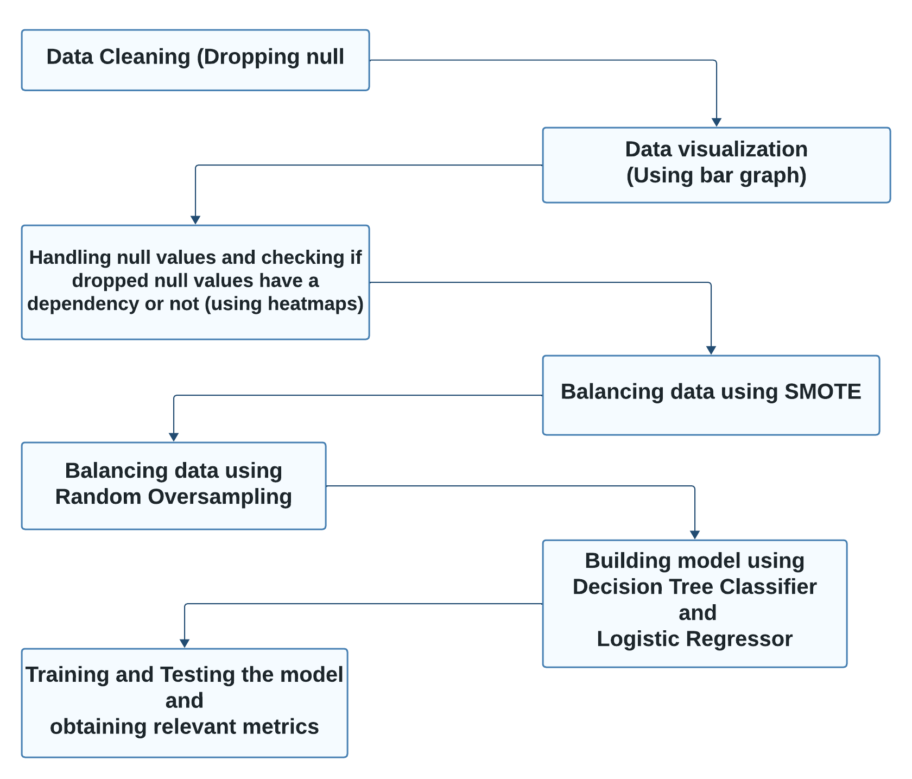

# Cerebral-Stroke-Prediction


## Project Overview
This project aims to address the critical healthcare challenge of predicting cerebral stroke risk. By employing appropriate data cleaning, data balancing techniques, and machine learning algorithms, the goal is to classify individuals as having a potential risk of cerebral stroke or not. Early detection can lead to proactive healthcare and potentially save lives.

---

## Problem Statement
Using available individual data, this project focuses on building models that predict the likelihood of a cerebral stroke using techniques to handle imbalanced datasets effectively.

---

## Uniqueness
Cerebral stroke, if not detected early, can have fatal consequences. This project uniquely leverages advanced machine learning techniques and imbalanced dataset strategies to contribute to healthcare innovation. 

---

## Dataset
- **Source**: [Mendeley Dataset](https://data.mendeley.com/datasets/x8ygrw87jw/1)
- **Size**: 43,400 rows and 12 columns
- **Attributes**:
  - ID
  - Gender
  - Age
  - Hypertension
  - Heart Disease
  - Ever Married
  - Work Type
  - Residence Type
  - Average Glucose Level
  - BMI
  - Smoking Status
  - Stroke (Target Column)

---

## Approach
### Data Preprocessing
1. **Data Cleaning**:
   - Dropped null values.
   - Checked dependencies of null values using heatmaps.

2. **Data Visualization**:
   - Explored attributes using bar graphs.

### Data Balancing Strategies
1. **Random Oversampling**
2. **Synthetic Minority Oversampling Technique (SMOTE)**

### Model Building
- Models Used:
  - Logistic Regression
  - Decision Tree Classifier

### Training and Evaluation
- Evaluated using:
  - Accuracy
  - Precision
  - Recall
  - F1 Score
- Visualization Techniques:
  - Box plots
  - Loss curves
  - Heatmaps
  - Bar graphs

---

## Workflow


---

## Results So Far
- Built models using two strategies:
  1. Random Oversampling + Logistic Regression, Decision Tree
  2. SMOTE + Logistic Regression, Decision Tree
- Metrics achieved so far:
  - Accuracy
  - Precision
  - Recall
  - F1 Score

---

## What's Next?
- Fine-tuning the models.
- Exploring additional balancing and regularization techniques.
- Further enhancing visualizations and interpretability.

---

## Key Learnings
- Handling imbalanced datasets is crucial for improving model performance.
- Effective data preprocessing significantly impacts model outcomes.
- Combining multiple strategies yields better insights and results.

---

## How to Run
1. Clone this repository:
   ```bash
   git clone https://github.com/Nagathejas-M-S/Cerebral-Stroke-Prediction.git
